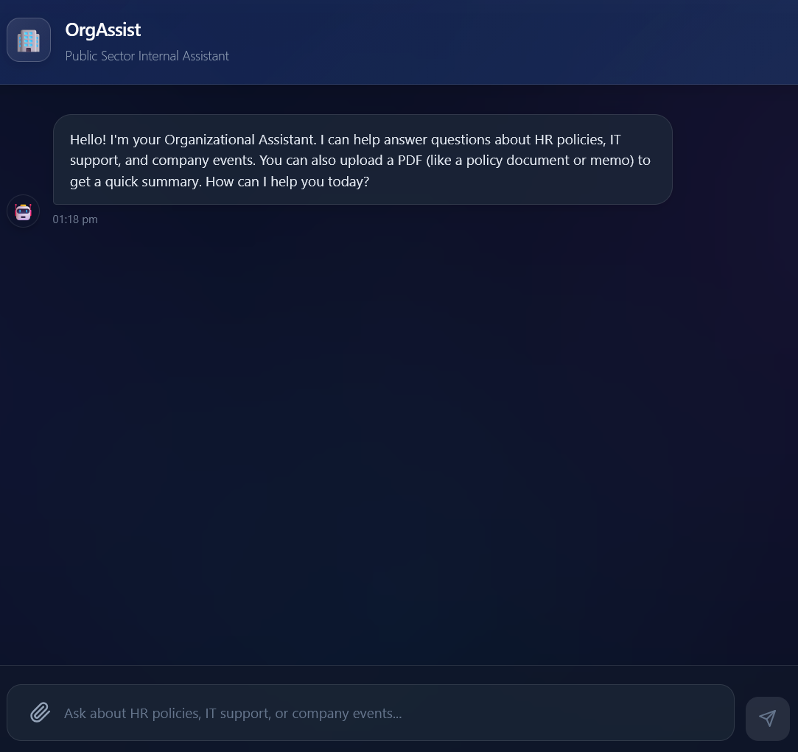

# OrgAssist - Public Sector Chatbot UI

A high-performance, modern React chatbot interface built for internal organizational use. It features a stunning dark-mode glassmorphism design, simulated AI responses, and integrated PDF upload capabilities. 

Built with **Vite** and **React**, this project is simple, responsive, and ready to be connected to a real backend LLM.

 <!-- Add a screenshot of the app here later! -->

## 🚀 Features

- **Modern Glassmorphism Design:** Beautiful dark UI with glowing background orbs, semi-transparent frosted glass elements, and smooth micro-animations.
- **Simulated Bot Intelligence:** Includes pre-programmed responses for keywords related to:
  - 🌴 HR Leave Policies
  - 💻 IT Support (VPN, Passwords)
  - 🎉 Company Events
- **Document Analysis (PDF):** Upload a PDF using the 📎 button! The app uses `pdfjs-dist` entirely in the browser to extract text and generate a mock summary + word count.
- **Fully Responsive:** Looks great on desktops, tablets, and mobile devices.
- **Optimized UX:** Message bubbles animate in naturally, input boxes auto-resize, and the chat auto-scrolls.

## 🛠️ Technology Stack

- **Frontend Framework:** React 18+
- **Build Tool:** Vite
- **Styling:** Custom CSS (Custom Properties, Flexbox, Animations, Glassmorphism)
- **PDF Processing:** `pdfjs-dist` (In-browser text extraction)

## 📦 Getting Started

Follow these steps to get the dev server running locally.

### 1. Requirements

Ensure you have **Node.js** (v18 or higher) installed on your system.

### 2. Clone and Install

```bash
# Provide your repo URL here when publishing
git clone https://github.com/your-username/orgassist-chat-ui.git

cd orgassist-chat-ui

# Install the necessary dependencies (React, Vite, pdfjs-dist, etc.)
npm install
```

### 3. Run the Development Server

```bash
npm run dev
```

Open your browser and navigate to the URL provided in the terminal (usually `http://localhost:5173`).

## 📁 Project Structure

```text
src/
├── components/
│   ├── ChatInput.jsx       # The bottom input bar with textarea & send button
│   ├── ChatWindow.jsx      # The scrollable area displaying the conversation
│   ├── MessageBubble.jsx   # Individual chat bubbles (User vs. Bot styling)
│   └── PDFUpload.jsx       # The hidden file input and pdf parsing logic
├── App.jsx                 # Main layout, State Management, and Mock Bot Logic
├── main.jsx                # React Entry Point
└── index.css               # Global Styles and Glassmorphism Design System
```

## 🧠 Connecting a Real Backend (Next Steps)

Currently, the bot logic is simulated directly in `App.jsx` using the `getBotResponse` function. 

To turn this into a real AI assistant:
1. Set up a backend server (Node/Express, Python/FastAPI, etc.)
2. Connect your backend to an LLM provider (like OpenAI, Google Gemini, or Anthropic).
3. In `App.jsx`, replace `getBotResponse` with a standard `fetch` call to your new API endpoint.

## 📄 License

This project is licensed under the MIT License - feel free to build upon it and use it for your organization!
